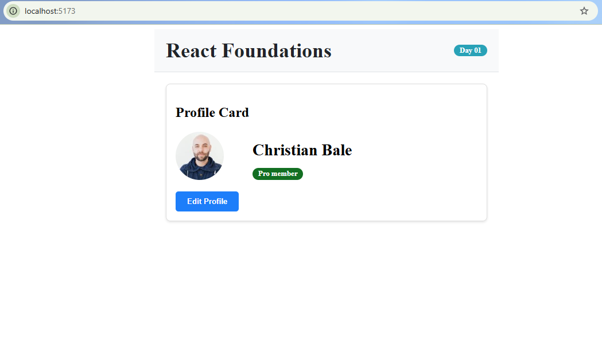

# Day 1: React Core Foundations

**Date:** [17 April, 2026]  
**Focus:** Setup, Virtual DOM, JSX Rules, 5 Reusable Components

---

## 🎯 Learning Objectives

- Set up a React project using **Vite** for lightning‑fast development.
- Understand the **Virtual DOM** and React's efficient rendering strategy.
- Internalize the **5 essential rules of JSX**.
- Build five foundational reusable components: `Button`, `Avatar`, `Badge`, `Card`, `Header`.

---

## 🧠 Key Concepts Covered

### 1. Virtual DOM
React creates a lightweight copy of the real DOM in memory. When state changes, React diffs the new Virtual DOM against the previous one and updates only the necessary parts of the real DOM. This minimizes expensive browser repaints.

### 2. The 5 Rules of JSX
| Rule | Example |
|------|---------|
| **Single Root Element** | `return (<div>...</div>)` or `<>...</>` |
| **camelCase Attributes** | `className`, `onClick` |
| **Curly Braces for Expressions** | `{variable}` |
| **Self‑Closing Tags** | ``, `<br />` |
| **PascalCase Component Names** | `<MyComponent />` |

### 3. Tooling: Vite
- **Why Vite?** Instant server start, Hot Module Replacement (HMR), optimized builds.

---

## 🧩 Components Built

| Component | Props | Purpose |
|-----------|-------|---------|
| `Button` | `text`, `onClick`, `variant` | Reusable action button with primary/secondary styles. |
| `Avatar` | `src`, `alt`, `size` | Displays a rounded user image. |
| `Badge` | `text`, `color` | Pill‑shaped status/label indicator. |
| `Card` | `title`, `children` | Container with border and shadow for grouping content. |
| `Header` | `title`, `rightElement` | Flexible header bar with title and custom right content. |    

---

## 🖼️ Screenshot



---

## 🔗 Commit

```bash
git commit -m "Day 1: React Core Foundations - Vite, JSX, Virtual DOM, 5 Components"
```