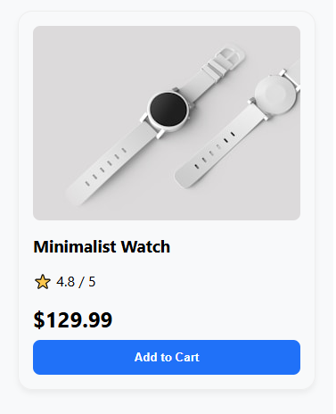

---

### 📗 `day-02-component-thinking.md`

```markdown
# Day 2: Mastering Functional Components & Component Thinking

**Date:** [18 April, 2026]  
**Focus:** Component Architecture, Props, Single Responsibility, Tree Visualization

---

## 🎯 Learning Objectives

- Understand the **anatomy of a functional component** (PascalCase, return JSX, Fragments).
- Adopt **component thinking** – break UIs into small, reusable pieces.
- Build **nested component trees** where data flows from parent to children via props.
- Create two complete component hierarchies: `ProfileCard` and `ProductCard`.

---

## 🧠 Key Concepts Covered

### 1. PascalCase Naming
Components **must** start with a capital letter so React distinguishes them from HTML tags.

### 2. Fragments (`<>...</>`)
Use Fragments to group multiple elements without adding extra DOM nodes.

### 3. Component Thinking & Single Responsibility
- Each component should do **one thing well**.
- Visualize UIs as **trees**, not monolithic pages.

### 4. Props (Properties)
Props are read‑only data passed from parent to child. They make components dynamic and reusable.

---

## 🧩 Components Built – ProfileCard Tree

```bash
ProfileCard (Parent)
├── Avatar
├── Name
├── Bio
└── SocialLinks
```

### Props Flow
| Child Component | Props Received |
|-----------------|----------------|
| `Avatar` | `imageUrl`, `altText`, `size` |
| `Name` | `firstName`, `lastName`, `title` |
| `Bio` | `text` |
| `SocialLinks` | `links` (array) |

---

## 🛍️ Mini Build – ProductCard Tree

```bash
ProductCard (Parent)
├── ProductImage
├── ProductTitle
├── ProductPrice
├── ProductRating
└── AddToCartButton
```

### Props Flow
| Child Component | Props Received |
|-----------------|----------------|
| `ProductImage` | `src`, `alt` |
| `ProductTitle` | `title` |
| `ProductPrice` | `price`, `currency` |
| `ProductRating` | `rating` |
| `AddToCartButton` | `onClick`, `disabled` |

---

## 📁 Project Structure (Day 2 Additions)

```bash
src/
├── components/
│ ├── Profile/
│ │ ├── ProfileCard.jsx
│ │ ├── Avatar.jsx
│ │ ├── Name.jsx
│ │ ├── Bio.jsx
│ │ └── SocialLinks.jsx
│ ├── Product/
│ │ ├── ProductCard.jsx
│ │ ├── ProductImage.jsx
│ │ ├── ProductTitle.jsx
│ │ ├── ProductPrice.jsx
│ │ ├── ProductRating.jsx
│ │ └── AddToCartButton.jsx
│ └── Card.jsx (refactored reusable container)
├── App.jsx
└── main.jsx
```

---

## 🖼️ Screenshots




---

## 🔗 Commit

```bash
git commit -m "Day 2: Component thinking - ProfileCard & ProductCard trees with nested components"
```

---

## 📚 Resources
React Docs: Components and Props

Thinking in React

Fragments